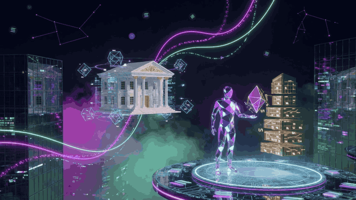
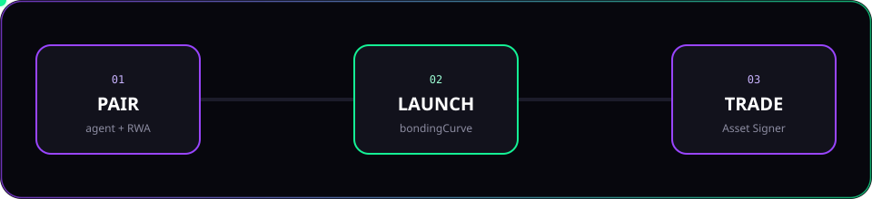
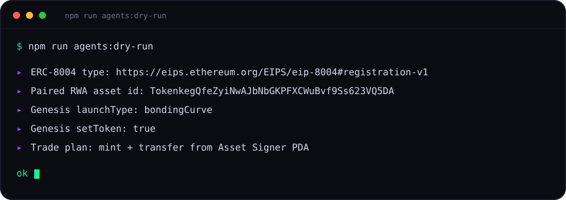

<p align="center">
  
</p>

<p align="center">
  
</p>

<h1 align="center">Solana RWA Agents</h1>

<p align="center">
  <strong>Pair a Metaplex AI agent with a tokenized real-world asset.<br/>Launch it. Let it trade from a wallet that has no private key.</strong>
</p>

<p align="center">
  <a href="https://github.com/Solizardking/solana-rwa-agents/stargazers"></a>
  <a href="https://github.com/Solizardking/solana-rwa-agents/actions/workflows/test.yml"></a>
  <a href="LICENSE"></a>
  
  
</p>

<p align="center">
  <a href="#onboard-in-60-seconds">Onboard</a> ·
  <a href="#pair--launch--trade">Pair · Launch · Trade</a> ·
  <a href="#the-program">Program</a> ·
  <a href="docs/agent-pairing.md">Docs</a>
</p>

---

Real estate. Gold. Art. Equity. Tokenize it on Solana, then bind a **registered Metaplex agent** to that asset. The agent’s Asset Signer PDA — seeds `["mpl-core-execute", asset]` — is the trading wallet. No private key. Dry-run until you say otherwise.

<p align="center">
  
</p>

| Step | What happens |
| --- | --- |
| **PAIR** | One agent Core asset + identity PDA + Asset Signer ↔ one RWA (and mint when tokenized) |
| **LAUNCH** | Genesis payload: `launchType: 'bondingCurve'`, `agent.setToken: true` |
| **TRADE** | `createFungible`, mint, transfer, `updateV1`, RWA `transfer_ownership` from the Asset Signer |

One agent per RWA unless you pass `replace: true`. `setToken` is one-shot. A second bind throws.

## Onboard in 60 seconds

You need Node 18+. That is it for the client.

```bash
git clone https://github.com/Solizardking/solana-rwa-agents.git
cd solana-rwa-agents
npm install
npm test
npm run agents:dry-run
```

You should see the EIP-8004 type, a paired RWA id, `bondingCurve`, `setToken: true`, and a mint + transfer plan. Nothing hits the chain.

<p align="center">
  
</p>

```bash
npm run agents:dry-run -- --agent <CORE> --rwa <ASSET> --rwa-id <ID> --mint <MINT> --to <WALLET>
```

Copy `.env.sample` → `.env` for the same knobs. Never commit a keypair.

Optional on-chain toolchain: Anchor **0.30.1**, Rust stable, Solana CLI.

```bash
anchor build
npm run test:anchor    # needs solana-test-validator
```

## Pair · Launch · Trade

```ts
import {
  createAgentUmiWithIdentity,
  pairAgentWithRwa,
  PairingRegistry,
  shapeCreateAndRegisterLaunch,
  buildTransferTokens,
  buildRwaTransferOwnership,
} from './agents';

const umi = createAgentUmiWithIdentity();
const registry = new PairingRegistry();

const pairing = pairAgentWithRwa(umi, {
  agentAsset,   // Metaplex Core asset
  rwaAsset,     // RWA account
  rwaAssetId,
  rwaMint,
  registry,
});

const launch = shapeCreateAndRegisterLaunch(pairing, {
  name: 'RWA Agent Token',
  symbol: 'RWAA',
  image: 'https://gateway.irys.xyz/your-image',
});
// launch.launchType === 'bondingCurve'
// launch.agent.setToken === true

const xfer = buildTransferTokens(umi, pairing, {
  destinationOwner,
  amount: 50,
});
const rwa = buildRwaTransferOwnership(umi, pairing, {
  destinationOwner,
  amount: 25,
});
// rwa.accounts.from === pairing.assetSigner
```

Identity builders ship too: `registerIdentityV1`, `registerExecutiveV1`, `delegateExecutionV1`, `revokeExecutionV1`. EIP-8004 `type` is exactly `https://eips.ethereum.org/EIPS/eip-8004#registration-v1`.

Deep dive: **[docs/agent-pairing.md](docs/agent-pairing.md)**

## Why this exists

The world is filling with agents that can talk. Very few can **own a slice of a building** and trade it under a verifiable identity.

This repo is the seam:

- **On-chain RWA** — register, tokenize, transfer, freeze, redeem.
- **On-chain agent** — Metaplex Core + AgentIdentity + Asset Signer PDA.
- **Off-chain executive** — you (or your bot) sign through Core Execute. Revoke anytime.

Broadcast is opt-in (`execute: true`). HTTP to Metaplex/Genesis is injectable. Tests never need a live cluster.

## The program

Placeholder program id: `RWA1111111111111111111111111111111111111111`

| Instruction | Purpose |
| --- | --- |
| `initialize` | Fees: registration, tokenization, platform bps |
| `register_asset` | Type, name, symbol, description, uri, valuation |
| `tokenize_asset` | Mint fractional supply to the owner |
| `transfer_ownership` | Move shares (client uses the paired Asset Signer as `from`) |
| `update_asset_metadata` | Name / description / uri |
| `verify_ownership` | Confirm a token account |
| `redeem_asset` | Burn to redeem the underlying |
| `set_asset_status` | Active · Frozen · Liquidated · Redeemed |

Types: RealEstate, Commodity, Artwork, IntellectualProperty, BusinessEquity, Other.

## Layout

```
agents/                      pairing · identity · genesis · trade
scripts/pair-and-launch.ts   world-facing dry-run
tests/agents-rwa.test.ts     shipped-path unit tests
programs/rwa-tokenization/   Anchor program
docs/assets/                 animated README art
```

## Safety

- Dry-run is the default. No `sendAndConfirm` unless `execute: true`.
- Do not put private keys, seed phrases, or wallet JSON in git.
- `setToken: true` is permanent. Do not set it on a throwaway mint.
- Replacing a pairing drops the old agent. It cannot sneak back via `bindAgentToken`.

## Join

If you tokenize the physical world, this is the agent door.

⭐ **Star** if you want agents that hold RWAs.  
🍴 **Fork** and pair your own Core asset.  
📣 Open an issue with the asset class you want next.

<p align="center">
  <sub>MIT · built for the open Solana agent stack · <a href="https://github.com/Solizardking/solana-rwa-agents">Solizardking/solana-rwa-agents</a></sub>
</p>
